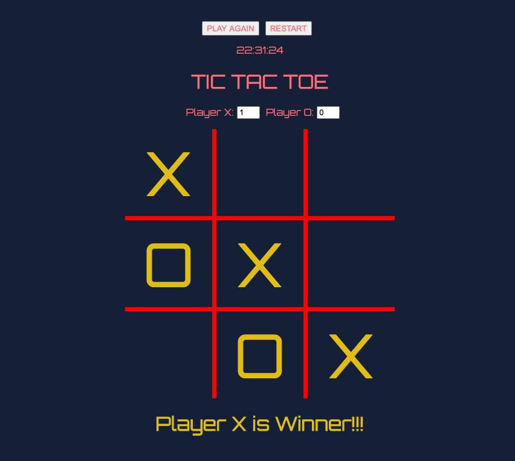

# Tic-Tac-Toe

<h1 align="center">
  
</h1>

# Index
  - [📝 About](#-about)
  - [💻 Technologies](#-technologies)
  - [Instructions to use it](#instructions-to-use-it)

## 📝 About
**Tic-tac-toe it's a project about a game called Tic-Tac-Toe (Jogo-da-velha).

---

## 💻 Technologies

This project uses technologies likes: 

- [Html](https://developer.mozilla.org/en-US/docs/Web/HTML)
- [Css](https://developer.mozilla.org/en-US/docs/Web/CSS)
- [Javascript](https://developer.mozilla.org/en-US/docs/Web/JavaScript)

---

## Instructions to use it

```bash

  # Clone repo
  $ git clone https://github.com/bonejah/tictactoe

  # Enter folder tictactoe
  $ cd tictactoe

  # Open file index.html in your browser

```
---
Developed by Bruno Lima July/2020 🦧
